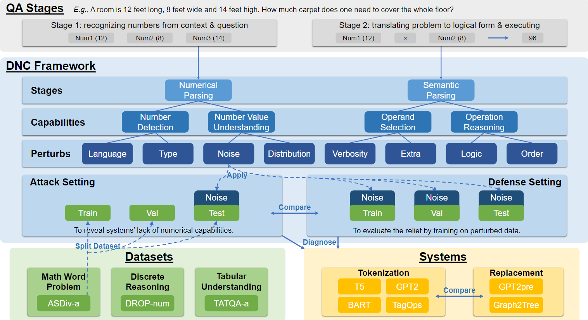
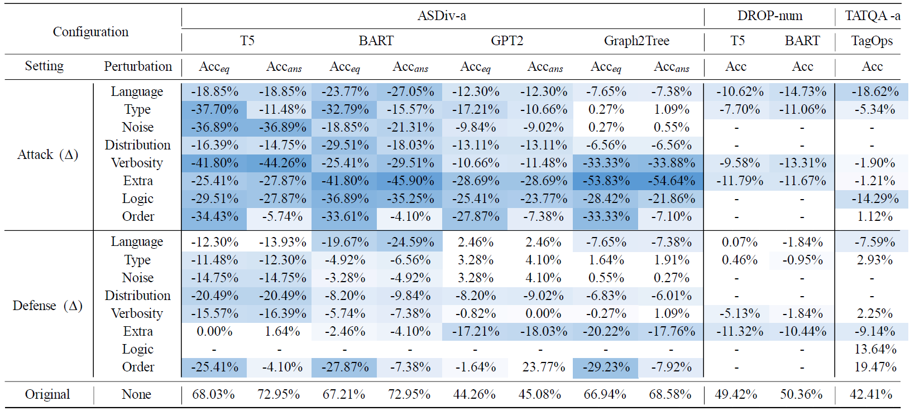

# DNC Framework

Code and data for the EMNLP 2022 paper [Towards Robust Numerical Question Answering: Diagnosing Numerical Capabilities of NLP Systems](https://aclanthology.org/2022.emnlp-main.542/). 



The DNC (Diagnosing Numerical Capability) framework is
proposed to probe the robustness in systems on Question
Answering datasets that require numerical reasoning
capabilities.

Four numerical capabilities, stemming from the
two solving stages of numerical QA questions, are highlighted.
Accordingly, eight perturbations are designed to probe these
capabilities. Being trivial to humans, these perturbations are
expected not to affect the system performance significantly.

Empirical Results show that current systems are errorprone
on the perturbed test set (“Attack”), and demonstrate nontrivial
performance drop even trained on the perturbed training
set (“Defense”).



## Datasets & Models 

### Datasets
* For all datasets, we refer users to original sources for the dataset files. 

<center>

|Dataset|Source|Original Paper|Comment|
|---|---|---|---|
|ASDiv-a|https://github.com/LYH-YF/MWPToolkit|[(Miao et al., 2020)](https://aclanthology.org/2020.acl-main.92/)||
|DROP|https://allenai.org/data/drop|[(Dua et al., 2019)](https://arxiv.org/abs/1903.00161)|DROP-num filtered by us|
|TATQA|https://nextplusplus.github.io/TAT-QA/|[(Zhu et al., 2022)](https://arxiv.org/abs/2105.07624)|TATQA-a filtered by us|

</center>

* We provide the fitlered `DROP-num`, `TATQA-a` and the manually curated `Logic` Attack challenge set for `ASDiv-a` in `data/dataset/`.

```
data
│
├─dataset
│  ├─asdiv-a-manual
│  │      testset.json
│  │      trainset.json
│  │      validset.json
│  │
│  ├─drop-num
│  │      testset.json
│  │      trainset.json
│  │      validset.json
│  │
│  └─tatqa-a
│          testset.json
│          trainset.json
│          validset.json
├─number_tokenizer
└─perturbation
```
* We also provide the perturbing scripts we used to create the Attack datasets and the Defense datasets in `data/perturbation/`, which can be called with

```bash
python -m data.perturbation.asdiv_a.asdiv_a_auto
python -m data.perturbation.drop_num.drop_num_auto
python -m data.perturbation.tatqa.tatqa_auto
```

### Models

* For `T5` and `BART`, we provide the scripts for experiments with pytorch-lightning. 
```
code
│
├─Gen_DROP
│      config.py
│      drop_dataset.py
│      drop_model.py
│      exp.py
│
└─Gen_MWP
        asdiv_dataset.py
        asdiv_model.py
        config.py
        exp.py
```
* The can be called with 
```bash
export CUDA_VISIBLE_DEVICES=0 # or more gpus, lightning automatically handles them
export SEED=<your_seed>
export MODEL_NAME=bart # or t5
export DATASET=asdiv-a # or drop-num / tatqa-a
export SETTING=atk # or def
export EPOCH=<your_epoch_number>

python -m Gen_MWP.exp \
--seed ${SEED} \
--model_name ${MODEL_NAME} \
--root_dataset_name ${DATASET} \
--setting_name ${SETTING} \
--max_epoch ${EPOCH}

```

* For `GPT2`, `Graph2Tree`, and `TagOps`, please refer to their existing implementation. 

<center>

|Model|Source|Original Paper
|---|---|---
|GPT2|https://github.com/LYH-YF/MWPToolkit|[(Radford et al., 2019)](https://cdn.openai.com/better-language-models/language_models_are_unsupervised_multitask_learners.pdf)||
|Graph2Tree|https://github.com/LYH-YF/MWPToolkit|[(Zhang et al., 2020)](https://aclanthology.org/2020.acl-main.362/)|
|TagOps|https://github.com/NExTplusplus/TAT-QA|[(Zhu et al., 2022)](https://arxiv.org/abs/2105.07624)|TATQA-a filtered by us|

</center>


## Dependency
We assume the usage of `conda` as the environment management tool.
```
conda create -n dnc python=3.9
conda activate dnc

pip install torch --extra-index-url https://download.pytorch.org/whl/cu116
pip install -U mwptoolkit pytorch-lightning
pip install -U -r requirements.txt
```

## Contributing

This project welcomes contributions and suggestions.  Most contributions require you to agree to a
Contributor License Agreement (CLA) declaring that you have the right to, and actually do, grant us
the rights to use your contribution. For details, visit https://cla.opensource.microsoft.com.

When you submit a pull request, a CLA bot will automatically determine whether you need to provide
a CLA and decorate the PR appropriately (e.g., status check, comment). Simply follow the instructions
provided by the bot. You will only need to do this once across all repos using our CLA.

This project has adopted the [Microsoft Open Source Code of Conduct](https://opensource.microsoft.com/codeofconduct/).
For more information see the [Code of Conduct FAQ](https://opensource.microsoft.com/codeofconduct/faq/) or
contact [opencode@microsoft.com](mailto:opencode@microsoft.com) with any additional questions or comments.

## Trademarks

This project may contain trademarks or logos for projects, products, or services. Authorized use of Microsoft 
trademarks or logos is subject to and must follow 
[Microsoft's Trademark & Brand Guidelines](https://www.microsoft.com/en-us/legal/intellectualproperty/trademarks/usage/general).
Use of Microsoft trademarks or logos in modified versions of this project must not cause confusion or imply Microsoft sponsorship.
Any use of third-party trademarks or logos are subject to those third-party's policies.

## Reference
If you find our work useful for your research, please consider citing
```
@inproceedings{xu-etal-2022-towards-robust,
    title = "Towards Robust Numerical Question Answering: Diagnosing Numerical Capabilities of {NLP} Systems",
    author = "Xu, Jialiang  and
      Zhou, Mengyu  and
      He, Xinyi  and
      Han, Shi  and
      Zhang, Dongmei",
    booktitle = "Proceedings of the 2022 Conference on Empirical Methods in Natural Language Processing",
    month = dec,
    year = "2022",
    address = "Abu Dhabi, United Arab Emirates",
    publisher = "Association for Computational Linguistics",
    url = "https://aclanthology.org/2022.emnlp-main.542",
    pages = "7950--7966",
    abstract = "Numerical Question Answering is the task of answering questions that require numerical capabilities. Previous works introduce general adversarial attacks to Numerical Question Answering, while not systematically exploring numerical capabilities specific to the topic. In this paper, we propose to conduct numerical capability diagnosis on a series of Numerical Question Answering systems and datasets. A series of numerical capabilities are highlighted, and corresponding dataset perturbations are designed. Empirical results indicate that existing systems are severely challenged by these perturbations. E.g., Graph2Tree experienced a 53.83{\%} absolute accuracy drop against the {``}Extra{''} perturbation on ASDiv-a, and BART experienced 13.80{\%} accuracy drop against the {``}Language{''} perturbation on the numerical subset of DROP. As a counteracting approach, we also investigate the effectiveness of applying perturbations as data augmentation to relieve systems{'} lack of robust numerical capabilities. With experiment analysis and empirical studies, it is demonstrated that Numerical Question Answering with robust numerical capabilities is still to a large extent an open question. We discuss future directions of Numerical Question Answering and summarize guidelines on future dataset collection and system design.",
}

```